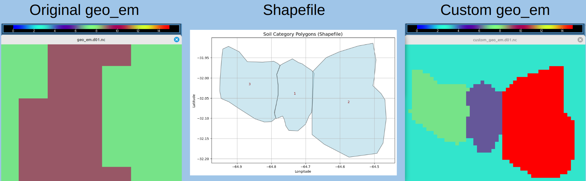

# Custom Soil Property Modifier for WRF Geogrid Files



**Authors:** Juan Sanchez & Matias Suarez  
**Context:** PhD Programme — WRF Custom Preprocessing Tools  
**File:** `mod_soil_properties.ipynb`  

---

## 📌 Description

This tool modifies **soil category variables** in a WRF `geo_em.d0X.nc` geogrid file using a **shapefile** that defines polygon-based regions with custom soil values.

The following variables are updated:
- `SCT_DOM`: Soil Category Top (dominant)
- `SCB_DOM`: Soil Category Bottom (dominant)
- `SOILCTOP`: 16-category boolean vector for top layer
- `SOILCBOT`: 16-category boolean vector for bottom layer

Each polygon in the shapefile assigns specific values to these variables for all enclosed grid cells.

To facilitate usage and testing, this tool includes:
- A **sample `geo_em.d01.nc` file**, and  
- A **sample shapefile** (`test.shp`) with polygon geometries and soil category IDs.  

These example files allow users to run and validate the script directly, and serve as templates.

---

## 📥 Required Inputs

### 1. **Shapefile**
- Format: Polygon (not multipolygon)
- Must include a column `id` that uniquely identifies each polygon
- Used to determine spatial extent of soil modifications

### 2. **WRF Geogrid File**
- Format: NetCDF (`geo_em.d0X.nc`)
- Must contain `XLAT_M`, `XLONG_M`, `SCT_DOM`, `SCB_DOM`, `SOILCTOP`, `SOILCBOT` variables

### 3. **Example Format of values_dict**
Defines the soil categories per polygon ID. Structure:

```python
values_dict = {
    'SCT_DOM': {
        1: 3,         # Polygon with ID 1 → assign soil category 3
        2: 15,        # Polygon with ID 2 → assign soil category 15
        3: 2,         # and so on...
        'def_val': 3  # Default value for grid points outside any polygon
    },
    'SCB_DOM': {
        1: 3,         # Polygon with ID 1 → assign soil category 3
        2: 15,        # Polygon with ID 2 → assign soil category 15
        3: 2,         # and so on...
        'def_val': 3  # Default value for grid points outside any polygon
    }
}
```
---

## 📁 Output

This notebook creates a copy of the original **geo_em.d0X.nc** file named **custom_geo_em.d0X.nc**

The file is saved in the same directory as the original and includes the modified soil variables.

Your original file remains unchanged.
